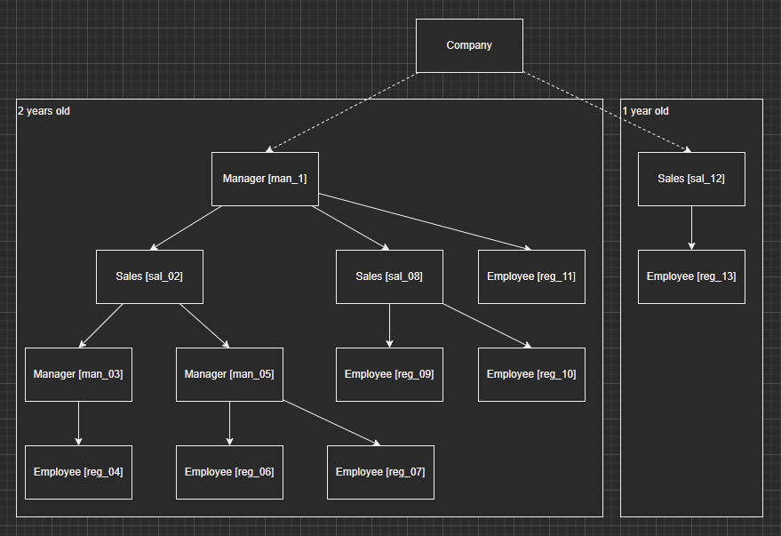

# Тестовое задание Aspose Slides

## Исходный текст задания

Есть компания, у компании могут быть сотрудники. Сотрудник характеризуется именем, датой поступления на работу, базовой ставкой (для простоты, это значение по-умолчанию одинаково для всех видов сотрудников).

Сотрудники бывают 3 видов - Employee, Manager, Sales. У каждого сотрудника может быть начальник. У каждого сотрудника кроме Employee могут быть подчинённые.

__Зарплата сотрудника `Employee`__ - это базовая ставка плюс 3% за каждый год работы в компании, но не больше 30% суммарной надбавки

__Зарплата сотрудника `Manager`__ - это базовая ставка плюс 5% за каждый год работы в компании (но не больше 40% суммарной надбавки за стаж работы) плюс 0,5% зарплаты всех подчинённых первого уровня

__Зарплата сотрудника `Sales`__ - это базовая ставка плюс 1% за каждый год работы в компании (но не больше 35% суммарной надбавки за стаж работы) плюс 0,3% зарплаты всех подчинённых всех уровней

У сотрудников (кроме Employee) может быть любое количество подчинённых любого вида. (*)

__Требуется:__ составить архитектуру классов, описывающих данную модель, а также реализовать алгоритм расчета зарплаты каждого сотрудника на произвольный момент времени (а также подсчёт суммарной зарплаты всех сотрудников фирмы в целом) с помощью c# / Visual Studio (консоль/пользовательский интерфейс на выбор, это не существенно для данной задачи).

Система должна быть проверена unit-testами (nUnit) /не обязательно полное покрытие, но должны быть показательные тесты для проверки бизнес-логики/.

Кроме того, требуется написать (на английском) краткий обзор своего решения тестовой задачи, описав архитектуру, ее плюсы и минусы (что можно улучшить или поменять или еще какие-то соображения для использования решения в реальных целях).

## Декомпозиция

В задаче предлагается предложить структуру данных описывающую взаимосвязи по правилам. Структура представляет из себя граф про который можно сказать следующее:

- граф направленный, где положительным направлением является направление от "начальника" к "подчиненному"
- в графе существуют листовые узлы `Employee`
- [1] принимается, что в графе нет двунаправленных связей поскольку все таки сотрудник не может быть руководителем и подчиненным по отношению к другому сотруднику одновременно, хотя это в структурном смысле и возможно в случае различного основания для подчиненности, на расчет выплат однако это не влияет и в этом случае связь учитывать необходимо
- [2] правило (*) говорит о том, что такого рода подчиненность может присутствовать опосредованно, такой цикл может разрешаться временем и\или недостатком информации в рамках цикла подчиненности и быть созданным намеренно в административном смысле, он является более общим по отношению к ситуации [1] по этому пункты [1] и [2] идентичны в структурном смысле
- [3] так же сказано, что у сотрудника может быть начальник, хотя из этого утверждения нельзя сделать вывод о том, что у сотрудника не может быть несколько начальников. В случае нескольких начальников для сотрудника, в рамках каждой связи, противоречия нет

Таким образом, комбинация спорных условий при непротиворечии прочих дает четыре случая из которых только случай полного отрицания позволяет представить структуру в виде дерева узлов с общим корнем. В остальных случаях граф имеет условные корни и должен быть представлен как циклический направленный. Условными корнями при этом можно представить сотрудников имеющих в прямом или опосредованном подчинении всех остальных. В таком графе так же может присутствовать разбиение на несколько компонентов с условными корнями в каждом. 

Для поиска решений или доказательства их отсутствия предложу стягивать с заменой циклы, решать получившийся ациклический граф и потому пытаться решить циклы для каждой замены, возможно, используя системы, надеюсь, линейных уравнений. При уточнении условий с [1], [2], [3] в отрицательную сторону, в случае вырождения DCG к дереву решение выглядит значительно проще.

## Согласование

После согласования с заказчиком задачи, внесены следующие поправки:

- у сотрудника может быть только один "начальник": то есть у каждого узла есть только одна отрицательная связь при большом количестве положительных, на основании этого утверждения можно хранить связь в узле
- любые циклы вида s1 > s2 > s3 > s1 недопустимы: соблюдение этого условия вытекает из предыдущего утверждения

Таким образом, для решения задачи достаточно использование структуры данных дерева узлов.

Решение предоставлено в проекте test-apose-tree. Тесты предоставлены в проекте test-apose-tests классе TestTree. тесты утилитарных методов предоставлены в проекте test-apose-tests классе TestDCG. Для тестирования решение используется дерево вида:

Расчет полной стоимости компании в тестах присутствует однако численно произведен в целях экономии времени и ввиду не обязательности по условию задания. Тесты на отказоустойчивость предоставлены в полном объеме как тесты на данных по расчету для работников ролей: служащего, управляющего, продавца, а так же для всей компании без количественной оценки. Задание реализовано в полном объеме.

## Implementation notes

Solution has been implemented as a tree like data structure with a list as a data storage. Data structure should not be changed since initialization (immutable). There is no any service data caching there since it's not necessary to traverse data marking because there are no issues as loops or cycles there. `Repository` class is used to hold all the data. `EmployeeBase` class represent particular employee data for company. `ILink` part of it serves as a calculation handler (facade) and used for node linkage purposes of entire data structure. Particular `EmployeeBase` based types are used as a calculation rules implementation and number of those can be extended to implement different roles. Sort of builder (`B` class family) is used to initialize tree structure by code but it's serves as a tool for that task only and probably should be removed in production purpose app. Application uses "promise like" calculation method, based on `IEnumerator` implementation. That makes code shorter and easier to read but brings less control over it and makes debugging harder.

pros:

- short and easy implementation
- well known and comparatively ease data structure with high ability to manage and observe
- ease to extend with additional role rules

cons:

- immutable data structure makes it harder to use solution with large number of employees
- implicitly generated objects makes resource consumption prediction less clear
- it's hard to implements multitasking because of single like data holder nature comparing with blackboard pattern
